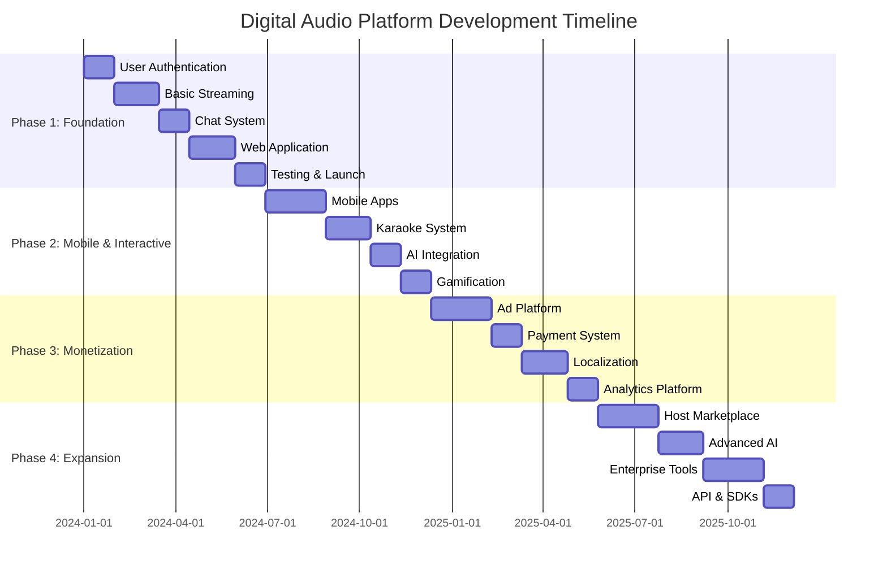

# Digital Audio Platform Production Plan
*Live Radio • AI Music Studio • Interactive Karaoke • Multi-Sided Platform*

## Executive Summary

This comprehensive production plan outlines a 4-phase development approach for a scalable digital audio platform serving multiple user segments (listeners, hosts, station owners, advertisers) with core features including 24/7 live radio, AI-powered music creation, interactive karaoke with gamification, and real-time social features.

---

## Technology Stack Analysis

### Core Architecture
**Backend Framework**: Node.js + Express/Fastify
- Proven scalability for real-time applications
- Rich ecosystem for audio processing and WebSocket support
- Excellent TypeScript integration

**Database Architecture**:
- **Primary**: PostgreSQL (user data, playlists, station management)
- **Real-time**: Redis (sessions, leaderboards, live chat)
- **Analytics**: ClickHouse (user behavior, streaming metrics)
- **Cache**: Redis (frequently accessed data)

### Audio Streaming Infrastructure
**Live Streaming**: AWS Elemental MediaLive + MediaPackage
- Professional-grade live streaming
- Adaptive bitrate streaming (HLS/DASH)
- Low-latency streaming support
- Built-in DRM and content protection

**CDN**: AWS CloudFront + MediaTailor
- Global edge locations for low latency
- Ad insertion capabilities
- Video/audio optimization
- 99.99% availability SLA

**Real-time Communication**: WebRTC + Socket.IO
- Low-latency audio transmission for karaoke
- Real-time chat and reactions
- Peer-to-peer connectivity options
- Fallback to WebSocket for older devices

### Mobile Development Framework
**Recommended**: Flutter
- Superior performance for real-time audio applications
- Single codebase for iOS/Android
- Excellent audio processing capabilities
- Strong WebSocket and WebRTC support

**Alternative**: React Native + Expo
- Larger developer ecosystem
- Faster development cycle
- Good React integration
- Slightly higher memory footprint

### AI Music Generation Integration
**Primary**: Suno API
- Highest quality AI-generated music
- Support for custom lyrics and styles
- Up to 8-minute track generation
- Commercial licensing options

**Alternative**: Udio API
- Competitive quality
- Different style options
- API integration available

### Real-time Features
**Chat System**: Socket.IO + Redis Adapter
- Scalable real-time messaging
- Room-based broadcasting
- Message persistence
- Typing indicators and read receipts

**Gamification**: Redis + PostgreSQL
- Leaderboards and scoring
- Achievement system
- Real-time updates
- Persistent progress tracking

---

## Development Phases

### Phase 1: Foundation MVP (Months 1-4)
**Budget**: $250K-400K
**Team**: 8-12 developers

#### Core Features:
- Basic user authentication and profiles
- 24/7 radio streaming (3 pre-programmed stations)
- Simple chat functionality
- Basic station owner dashboard
- Web application (mobile web responsive)

#### Technical Implementation:
```typescript
// Core tech stack for Phase 1
- Node.js + Express backend
- PostgreSQL for user data
- Redis for sessions
- AWS MediaLive for streaming
- React web frontend
- Basic WebSocket implementation
```

#### Deliverables:
- User registration/login system
- Radio player with station selection
- Real-time chat during broadcasts
- Station management portal
- Basic analytics dashboard

#### Success Metrics:
- 1,000+ registered users
- 50+ concurrent listeners
- 3 active stations
- <2-second stream latency

### Phase 2: Mobile & Interactive Features (Months 5-8)
**Budget**: $350K-500K
**Team**: 12-18 developers

#### New Features:
- iOS/Android mobile apps
- Interactive karaoke system
- Basic gamification (points, leaderboards)
- AI music generation studio (beta)
- Enhanced real-time features

#### Technical Implementation:
```typescript
// Phase 2 tech additions
- Flutter mobile apps
- WebRTC for real-time audio
- Suno API integration
- Redis Pub/Sub for real-time features
- Push notification system
- Enhanced analytics
```

#### Deliverables:
- Native mobile apps (iOS/Android)
- Karaoke recording and playback
- AI music creation interface
- User profiles with achievements
- Enhanced station owner tools

#### Success Metrics:
- 10,000+ mobile app downloads
- 500+ daily active users
- 1,000+ karaoke recordings
- 100+ AI-generated tracks

### Phase 3: Monetization & Scale (Months 9-12)
**Budget**: $500K-750K
**Team**: 18-25 developers

#### New Features:
- Ad-tech platform with self-serve portal
- Subscription tiers
- Virtual gifting economy
- Advanced analytics
- Multi-language support (Arabic)

#### Technical Implementation:
```typescript
// Phase 3 tech additions
- Programmatic ad integration (VAST)
- Stripe payment processing
- Virtual currency system
- Arabic localization (RTL support)
- Advanced analytics (Mixpanel)
- Enhanced moderation tools
```

#### Deliverables:
- Self-serve advertising platform
- Subscription management system
- Virtual gift marketplace
- Arabic language support
- Advanced analytics and reporting

#### Success Metrics:
- $10K+ monthly revenue
- 50,000+ registered users
- 20+ active stations
- 1,000+ paying subscribers

### Phase 4: Platform Expansion (Months 13-18)
**Budget**: $750K-1.2M
**Team**: 25-35 developers

#### New Features:
- Host marketplace
- Advanced AI features
- Social features expansion
- Enterprise tools for broadcasters
- API for third-party integrations

#### Technical Implementation:
```typescript
// Phase 4 tech additions
- GraphQL API for integrations
- Advanced AI music generation
- Machine learning for recommendations
- Advanced moderation automation
- Enterprise analytics platform
```

#### Deliverables:
- Host booking marketplace
- Advanced AI music tools
- Enhanced social features
- Enterprise broadcasting tools
- Public API and SDKs

#### Success Metrics:
- 100,000+ registered users
- $100K+ monthly revenue
- 100+ active stations
- Enterprise clients onboarded

---

## Infrastructure Architecture

### Cloud Infrastructure (AWS)
```
                    ┌─────────────────────────────┐
                    │        CloudFront CDN        │
                    │    (Global Edge Locations)   │
                    └─────────────┬───────────────┘
                                 │
                    ┌─────────────▼───────────────┐
                    │    Application Load Balancer │
                    └─────────────┬───────────────┘
                                 │
         ┌───────────────────────┼───────────────────────┐
         │                       │                       │
┌────────▼────────┐   ┌─────────▼─────────┐   ┌─────────▼─────────┐
│  Web Servers    │   │  Mobile API       │   │  Media Services   │
│  (EC2 Auto      │   │  (ECS/Fargate)    │   │  (MediaLive/      │
│   Scaling)      │   │                   │   │   MediaPackage)   │
└────────┬────────┘   └─────────┬─────────┘   └─────────┬─────────┘
         │                      │                       │
         └──────────────────────┼───────────────────────┘
                                │
                    ┌───────────▼────────────┐
                    │   Data Layer           │
                    │  PostgreSQL (RDS)      │
                    │  Redis (ElastiCache)   │
                    │  S3 (File Storage)     │
                    └────────────────────────┘
```

### Microservices Architecture
```yaml
Services:
  - User Service (authentication, profiles)
  - Streaming Service (radio, live audio)
  - Chat Service (real-time messaging)
  - AI Service (music generation)
  - Karaoke Service (recording, playback)
  - Analytics Service (metrics, reporting)
  - Ad Service (monetization, VAST)
  - Payment Service (subscriptions, gifts)

Communication:
  - REST APIs (synchronous)
  - Event Bus (Redis Pub/Sub)
  - WebSocket (real-time features)
  - GraphQL (client queries)
```

### DevOps & CI/CD
**Pipeline**: GitHub Actions + AWS CodePipeline
```yaml
Development:
  - Feature branches with automated testing
  - Pull request reviews
  - Automated security scanning

Deployment:
  - Blue-green deployments
  - Canary releases for critical services
  - Automatic rollback on failures

Monitoring:
  - CloudWatch for infrastructure
  - New Relic for APM
  - Sentry for error tracking
  - Custom dashboards (Grafana)
```

---

## Third-Party Integrations

### Core Services
| Service | Purpose | Cost Structure |
|---------|---------|----------------|
| **AWS MediaLive** | Live streaming encoder | $0.79/hour + output fees |
| **AWS MediaPackage** | Stream packaging | $0.075/hour |
| **AWS CloudFront** | CDN delivery | $0.085/GB (US) |
| **Suno API** | AI music generation | $0.05-0.10/track |
| **Twilio** | SMS verification | $0.0079/SMS |
| **Stripe** | Payment processing | 2.9% + $0.30/transaction |

### Analytics & Marketing
| Service | Purpose | Recommended Plan |
|---------|---------|------------------|
| **Mixpanel** | User behavior analytics | Growth Plan ($25K/year) |
| **Google Analytics 4** | Web/app analytics | Free tier |
| **Braze** | Push notifications | Pro Plan ($150K/year) |
| **Segment** | Data pipeline | Business Plan ($120K/year) |

### Communication
| Service | Purpose | Recommended Plan |
|---------|---------|------------------|
| **SendGrid** | Email delivery | Pro Plan ($120/month) |
| **OneSignal** | Push notifications | Growth Plan ($150/month) |

---

## Timeline & Milestones

### Critical Path Analysis


### Monthly Milestones
**Month 1-2**: Core infrastructure setup, user system
**Month 3-4**: Basic streaming functionality, web app launch
**Month 5-6**: Mobile app development, testing
**Month 7-8**: Karaoke features, AI integration
**Month 9-10**: Monetization features, ad platform
**Month 11-12**: Localization, enhanced analytics
**Month 13-15**: Marketplace development
**Month 16-18**: Advanced features, enterprise tools

---

## Risk Assessment & Mitigation

### Technical Risks
| Risk | Probability | Impact | Mitigation Strategy |
|------|-------------|--------|-------------------|
| **Audio latency issues** | Medium | High | WebRTC optimization, edge computing |
| **Scalability bottlenecks** | High | High | Microservices architecture, auto-scaling |
| **AI API rate limits** | Medium | Medium | Multiple providers, caching strategies |
| **Mobile performance** | Medium | High | Native optimization, performance testing |

### Business Risks
| Risk | Probability | Impact | Mitigation Strategy |
|------|-------------|--------|-------------------|
| **User adoption** | Medium | High | Phased rollout, user feedback loops |
| **Content licensing** | High | Critical | Legal review, royalty management |
| **Revenue targets** | Medium | High | Multiple revenue streams, testing |
| **Competition** | High | Medium | Unique features, community building |

### Operational Risks
| Risk | Probability | Impact | Mitigation Strategy |
|------|-------------|--------|-------------------|
| **Team scaling** | Medium | Medium | Clear hiring plan, documented processes |
| **Technical debt** | High | Medium | Code reviews, refactoring sprints |
| **Security breaches** | Medium | Critical | Security audits, penetration testing |
| **Vendor dependencies** | Medium | Medium | Multi-vendor strategies, SLA review |

---

## Cost Optimization Strategies

### Infrastructure Optimization
**Serverless Components**:
- AWS Lambda for scheduled jobs
- API Gateway for API management
- S3 for static asset hosting
- CloudFront for CDN caching

**Database Optimization**:
- Read replicas for analytics
- Connection pooling
- Query optimization
- Caching strategies

**Stream Optimization**:
- Adaptive bitrate streaming
- Edge caching of popular content
- Compression algorithms
- Network optimization

### Development Efficiency
**Team Structure**:
- Cross-functional teams
- Shared components libraries
- Automated testing
- Code generation tools

**Process Optimization**:
- Continuous integration/deployment
- Infrastructure as code
- Monitoring and alerting
- Documentation as code

---

## Monetization Technical Implementation

### Ad-Tech Platform
```typescript
// Ad insertion architecture
interface AdPlatform {
  // Programmatic advertising
  VASTIntegration: {
    PreRoll: boolean;
    MidRoll: boolean;
    PostRoll: boolean;
    Frequency: number;
  };

  // Self-serve portal
  AdvertiserPortal: {
    CampaignManagement: boolean;
    TargetingOptions: string[];
    BudgetManagement: boolean;
    Analytics: boolean;
  };

  // Revenue optimization
  DynamicAdInsertion: boolean;
  HeaderBidding: boolean;
  YieldOptimization: boolean;
}
```

### Subscription System
```typescript
// Subscription tiers
interface SubscriptionModel {
  Free: {
    Features: string[];
    Limitations: string[];
  };

  Premium: {
    Price: "$9.99/month";
    Features: string[];
    AdFree: true;
  };

  Pro: {
    Price: "$19.99/month";
    Features: string[];
    AIcredits: number;
    PrioritySupport: true;
  };
}
```

### Virtual Economy
```typescript
// Gifting and microtransactions
interface VirtualEconomy {
  Currency: {
    Coins: {
      PurchaseRate: "100 coins = $1";
      Usage: "Gifts, effects, premium features";
    };
  };

  Marketplace: {
    VirtualGifts: string[];
    DigitalEffects: string[];
    Customizations: string[];
  };

  RevenueShare: {
    Hosts: "70% of gift value";
    Platform: "30% of gift value";
  };
}
```

---

## Success Metrics & KPIs

### Technical KPIs
- **Stream Latency**: <2 seconds (95th percentile)
- **Uptime**: 99.9% availability
- **App Load Time**: <3 seconds
- **Crash Rate**: <0.5% of sessions

### Business KPIs
- **Monthly Active Users**: Growth target 20% month-over-month
- **Revenue Per User**: $2-5 average
- **Churn Rate**: <5% monthly
- **Station Engagement**: 60+ minutes average session

### User Engagement
- **Daily Active Users**: 30% of MAUs
- **Karaoke Participation**: 20% of users record weekly
- **Chat Engagement**: 40% of users send messages
- **AI Feature Usage**: 15% of users generate music

---

## Next Steps & Recommendations

### Immediate Actions (Next 30 Days)
1. **Team Assembly**: Hire core development team
2. **Infrastructure Setup**: Establish AWS accounts and basic architecture
3. **Legal Review**: Content licensing and user agreements
4. **UI/UX Design**: Wireframes and user journey mapping

### Phase 1 Priorities
1. **MVP Focus**: Core streaming functionality first
2. **User Testing**: Early feedback from target audience
3. **Performance**: Optimize for low-latency streaming
4. **Scalability**: Build for growth from day one

### Long-term Considerations
1. **International Expansion**: Plan for global scalability
2. **AI Evolution**: Stay current with music generation advances
3. **Regulatory Compliance**: Monitor audio content regulations
4. **Technology Evolution**: Regular tech stack reviews and updates

---

This production plan provides a comprehensive roadmap for building a scalable digital audio platform that can compete in the modern streaming landscape while maintaining technical excellence and business viability.